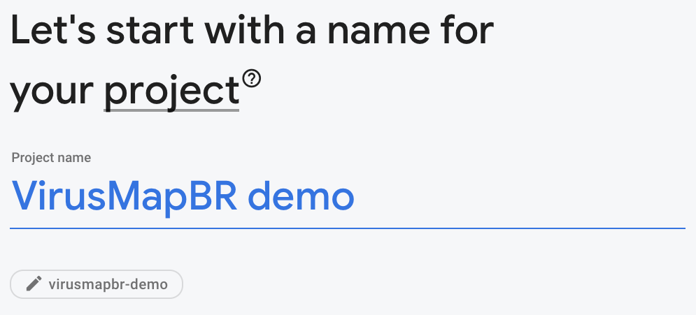
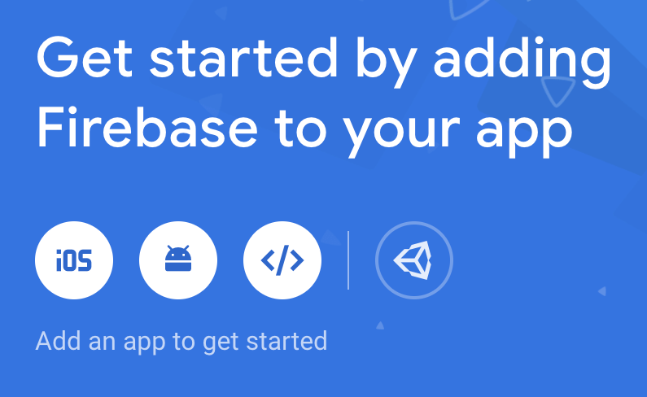
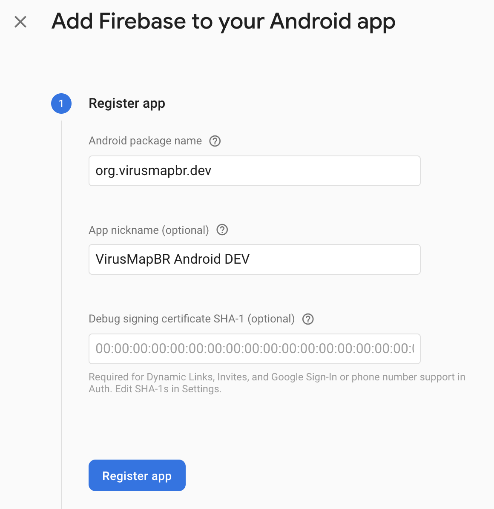
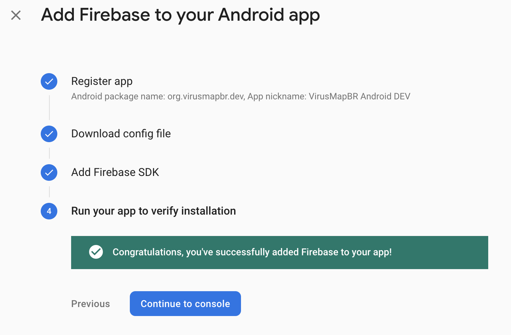
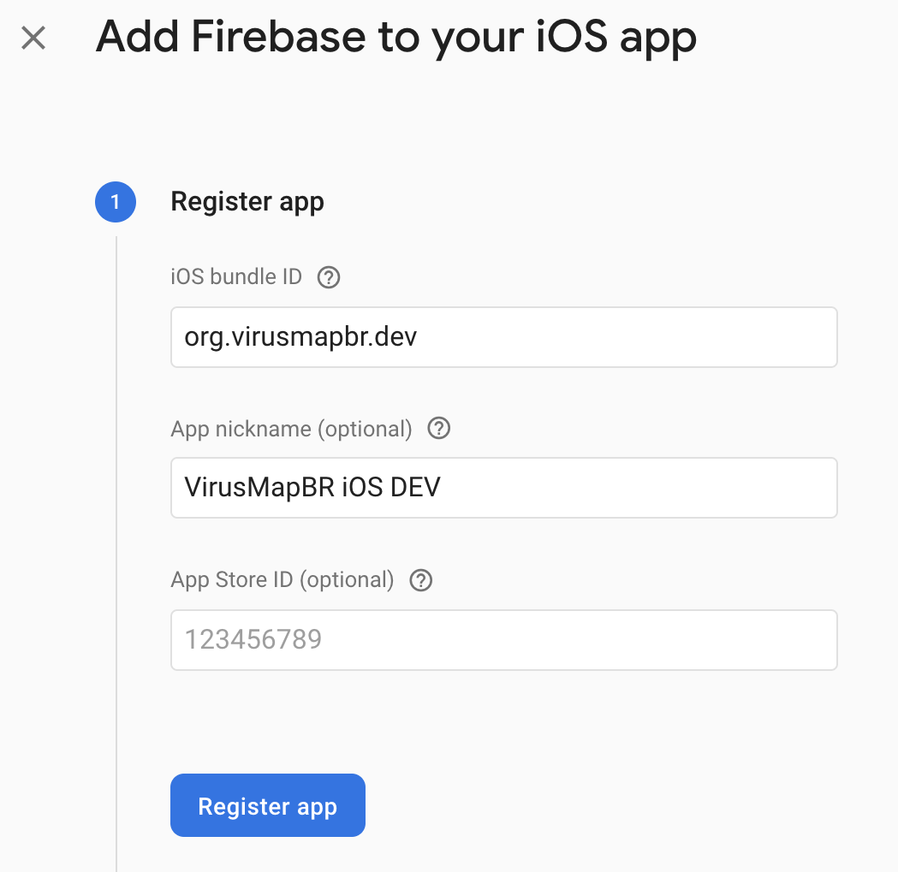
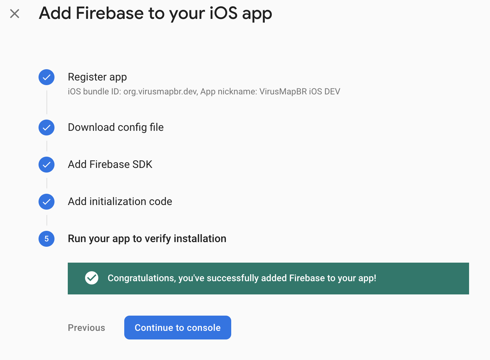
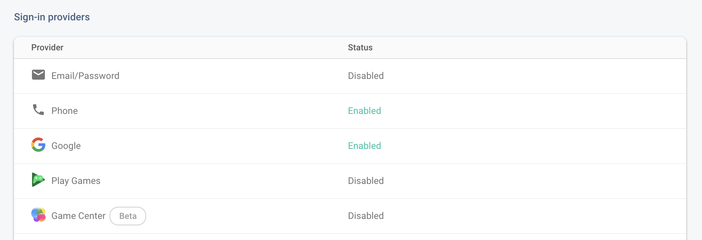

# VirusMapBR

An open-source COVID-19 tracking app built with Flutter and Firebase

The **VirusMapBR** was created in the begining of COVID-19 pandemic as a way to track the evolution of the disease in Brazil using data from our community. The idea was to create an independent crowdsourced map of the Coronavirus cases in Brazil that could be used to better understand the situation in the country and to allow people to handle thir lifes with better information. However, the app couldn't be published in the Apple and Google app stores since it was related to COVID-19 and not associated to official entities or health instutitions.

## About the Author
Hi! My name is [**Manoel Lemos**](https://manoellemos.com/) and I'm a computer engineer from Brazil. I used to be an entrepreneur and today I'm a parter at [**Redpoint eventures**](http://rpev.com.br), a VC fund focused in early-stage startups in the Brazilian and LatAm ecosystems. I'm passionate about technology and its potential to positively impact society. I love to build things and I'm always learning new stuff, writing some code and soldering some components.

This project was my introduction to Dart, Flutter and Firebase and it started in a very different way. You can read more about the [origins and motivations of the project](https://manoellemos.com/um-app-para-combater-a-pandemia-do-coronav%C3%ADrus-9f3d6fa34eb8), and [the learnings with the **VirusMapBR** development journey]() in my blog. 

# Requirements

* Dart 2.9.2
* Flutter 1.20.3
* Firebase
* Wordpress (optional)

# Getting Started

It should be very easy to clone the repo and run the app in your machine. The complications will be mostly around configuring Firebase.

## 1. Clone the repository in your development machine

## 2. Create a new project on Firebase

Once the project is created, you'll need to add the Android and iOS apps to your project:

## 3. Setup Firebase for Android

Copy the generated `google-services.json` to the folder `/android/app/src/debug/` in the project tree.

Run the app in the Android Emulator and wait for a confirmation that everything is fine from Firebase.

## 4. Setup Firebase for iOS

Copy the generated `GoogleService-Info.plist` to the folders `/ios/debug/` and `/ios/release/` in the project tree.

Run the app in the iOS Simulator and wait for a confirmation that everything is fine from Firebase.

## 5. Setup Firebase Authentication

We use two sign-in methods: Google and Phone. You'll have to activate both.

## 6. Setup Cloud Firestore

We use the Firebase Cloud Firestore to store the app data. You'll have to enable it and create a document for our stats.

Create a collection called `stats` and a document with the id `dashboard` with the following fields: 

## 7. Setup Firebase Storage

We use the Firebase Storage to store the user submited avatars. Just enable the service.

## 8. Setup Crashlytics

We use Firebase Crashlytics to monitor the app crashes. Just enable the service.

## 9. Wordpress (optional)

We use an Wordpress as a CMS for the news and help entries of the app. You can use yours if you want.

To do so, you'll have to change the code in the files `help_entries_list.dart`, `wp_latest_news.dart` and `news_provider.dart` to use your instance of Wordpress. Search for the `baseUrl` parameter and adjust it for your install.

## HeyHo! That's all!

If everything is fine, you'll be able to run the app again and use it on your development devices or emulators.

I hope you enjoy the ride, learn new stuff and use it to build new things and help others!

# Thanks and acknowledgemnts

During this journey I had the support of many friends. From changing my mind towards the final design of the app, to solving technical challenges, designing the look and feel of the app, refining the user experience, trying to workaround the app store's constraints, writing the terms-of-use and the privacy policy, reviewing the app and supporting the idea. It was such an honor to have the support of these incredible people and I'm forever thankfull.

* André Barrence - [@andrevsb](https://twitter.com/andrevsb)
* André Salem - [@andresalem](https://www.linkedin.com/in/andresalem)
* Celina Bottino - [@cbotinno](https://cyber.harvard.edu/people/celina-bottino)
* Georges Bennati - [@gbenatti](https://github.com/gbenatti)
* Josias Cunha - [@josiasnc](https://dribbble.com/josiasnc)
* Luciano Tavares - [@lucianot](https://twitter.com/lucianot)
* Ronaldo Lemos - [@lemos_ronaldo](https://twitter.com/lemos_ronaldo)

Thanks, you rock!

